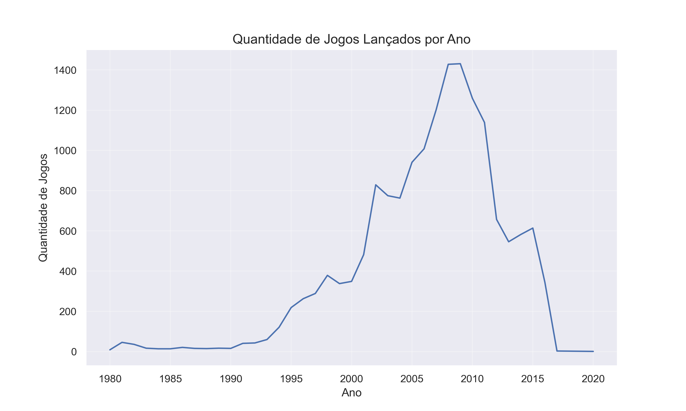
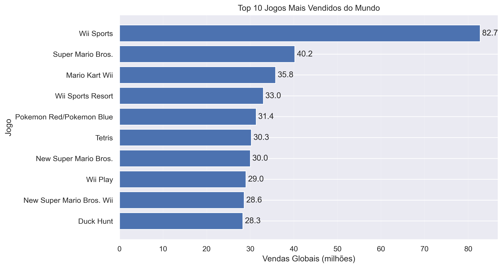
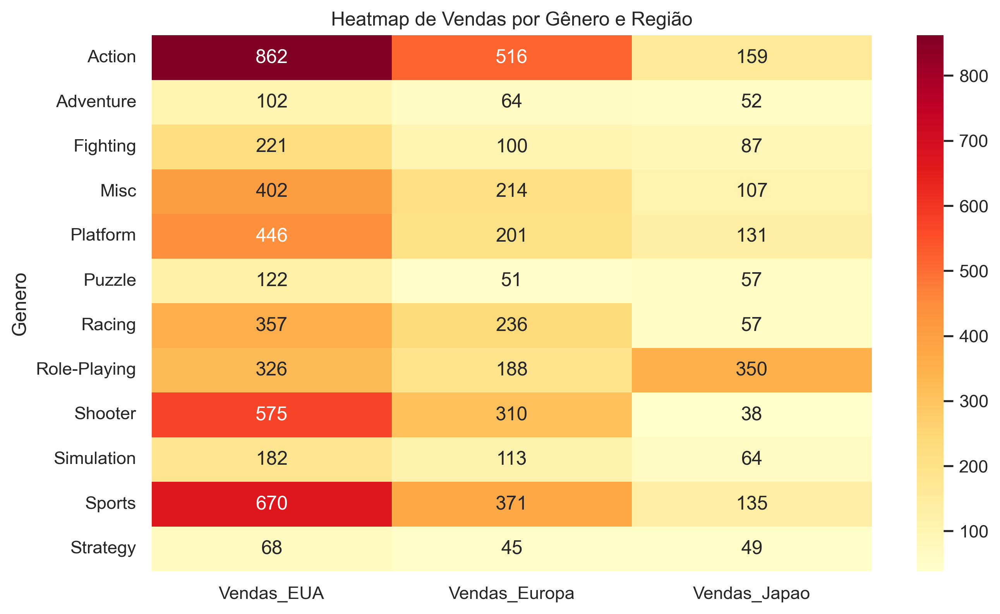

# Video Game Sales Analysis

Projeto de análise exploratória de dados utilizando Python para investigar padrões de vendas na indústria de videogames.

## Tecnologias utilizadas

- Python
- Pandas
- Matplotlib
- Seaborn
- Jupyter Notebook

## Principais análises

- Evolução da indústria ao longo dos anos
- Jogos mais vendidos da história
- Gêneros mais populares
- Consoles dominantes por período
- Diferenças regionais de consumo

## Exemplos de visualizações

